# Cortex — Engine Architecture

This document covers the internal mechanics of `src/run-autonomous.mjs` and `bin/cli.mjs` for contributors and anyone who wants to understand how the harness works.

---

## Overview

Cortex runs a deterministic state machine driven by a **task queue**. Every cycle runs inside a subprocess (`claude -p`), emits exactly one signal, and writes a Zod-validated JSON output file. The outer loop reads signals and advances the queue. For multi-intent tasks, the queue is decomposed into ordered groups at plan time and may be extended at runtime by the cross-group reconcile cycle.



---

## Task Queue

The `orchestrate` cycle writes `.harness/task-queue.json` — a manifest that defines every downstream cycle, its type, the owning agent, its output file, and whether it may run in parallel. The main loop consumes this file one batch at a time. Nothing after `orchestrate` is hardcoded.

**Single-intent example:**

```json
{
  "task": "add product listing page",
  "promptType": "implement-feature",
  "cycles": [
    {
      "id": "explore",
      "type": "explore",
      "status": "pending",
      "parallel": false
    },
    {
      "id": "implement-backend",
      "type": "implement-backend",
      "status": "pending",
      "parallel": true,
      "agent": "backend-subagent"
    },
    {
      "id": "implement-frontend",
      "type": "implement-frontend",
      "status": "pending",
      "parallel": true,
      "agent": "frontend-subagent"
    },
    {
      "id": "reconcile",
      "type": "reconcile",
      "status": "pending",
      "parallel": false
    },
    { "id": "test", "type": "test", "status": "pending", "parallel": false },
    {
      "id": "deliver",
      "type": "deliver",
      "status": "pending",
      "parallel": false
    }
  ]
}
```

**Multi-intent example** (two groups + shared cycles):

```json
{
  "task": "fix broken search, add export CSV",
  "promptType": "multi-intent",
  "intents": [
    {
      "subTask": "fix broken search filter",
      "promptType": "fix-bug",
      "group": "fix-search"
    },
    {
      "subTask": "add export to CSV feature",
      "promptType": "implement-feature",
      "group": "add-export"
    }
  ],
  "cycles": [
    {
      "id": "explore",
      "type": "explore",
      "status": "pending",
      "parallel": false
    },
    {
      "id": "reproduce-fix-search",
      "type": "reproduce",
      "status": "pending",
      "taskGroup": "fix-search",
      "subTask": "fix broken search filter"
    },
    {
      "id": "implement-backend-fix-search",
      "type": "implement-backend",
      "status": "pending",
      "taskGroup": "fix-search",
      "agent": "backend-subagent",
      "parallel": true
    },
    {
      "id": "implement-frontend-fix-search",
      "type": "implement-frontend",
      "status": "pending",
      "taskGroup": "fix-search",
      "agent": "frontend-subagent",
      "parallel": true
    },
    {
      "id": "reconcile-fix-search",
      "type": "reconcile",
      "status": "pending",
      "taskGroup": "fix-search"
    },
    {
      "id": "test-fix-search",
      "type": "test",
      "status": "pending",
      "taskGroup": "fix-search"
    },
    {
      "id": "implement-backend-add-export",
      "type": "implement-backend",
      "status": "pending",
      "taskGroup": "add-export",
      "agent": "backend-subagent",
      "parallel": true
    },
    {
      "id": "implement-frontend-add-export",
      "type": "implement-frontend",
      "status": "pending",
      "taskGroup": "add-export",
      "agent": "frontend-subagent",
      "parallel": true
    },
    {
      "id": "reconcile-add-export",
      "type": "reconcile",
      "status": "pending",
      "taskGroup": "add-export"
    },
    {
      "id": "test-add-export",
      "type": "test",
      "status": "pending",
      "taskGroup": "add-export"
    },
    {
      "id": "reconcile-cross-group",
      "type": "reconcile",
      "status": "pending",
      "taskGroup": null
    },
    {
      "id": "deliver",
      "type": "deliver",
      "status": "pending",
      "parallel": false
    }
  ]
}
```

---

## Multi-Intent Decomposition

When the orchestrate cycle detects mixed verb clusters in the task description (e.g. fix + implement + edit), it decomposes the task into ordered **groups** before writing the queue.

**Ordering rule:** fix groups run before edit groups, which run before implement/create groups. This ensures fixes restore correct state before new behavior is layered on top.

**Shared explore (default):** A single shared `explore` cycle (no `taskGroup`, `outputFile: "explore.json"`) feeds all groups. Per-group explores are only emitted when the task description makes it unambiguous that the groups touch completely separate surfaces with no shared code.

**Group cycle naming:** All cycles in a group carry `taskGroup: "<slug>"` and `subTask: "<text>"`. Their `id` and `outputFile` include the group slug as a suffix (e.g. `implement-backend-fix-search`, `test-fix-search.json`). Shared cycles (`explore`, `reconcile-cross-group`, `deliver`) omit `taskGroup`.

**Context propagation:** Each implement and reconcile cycle receives ALL previously completed implement reports as prior context — not just its own group's. This gives later groups visibility into what earlier groups changed, enabling correct shared-contract decisions.

---

## Cross-Group Reconcile & Dynamic Queue Extension

After all groups' test cycles complete, `reconcile-cross-group` runs as a shared reconcile step. Its job is to verify that shared type/schema changes made by one group are correctly consumed by all other groups.

It also performs **workflow type validation**: it reviews each group's implement reports and checks whether the cycle type (fix-bug, implement-feature, edit-feature) was appropriate given what the agent actually found. If a mismatch is detected — for example, a fix-bug group found no actual bug, or an implement group found it first needed to fix something broken — the reconcile report includes a `requiresAdditionalGroups[]` array.

```json
{
  "requiresAdditionalGroups": [
    {
      "reason": "implement-backend-add-export found that the export endpoint is broken, not absent — needs fix first",
      "subTask": "fix broken export endpoint",
      "suggestedPromptType": "fix-bug",
      "suggestedAgents": ["backend-subagent"],
      "group": "fix-export-endpoint"
    }
  ]
}
```

The runner reads this after `reconcile-cross-group` completes and calls `injectAdditionalGroups()`, which:

1. Calls `buildAdditionalGroupCycles()` — constructs a full cycle group (reproduce if fix-bug, explore, implement-\*, reconcile, test) for each entry
2. Splices the new cycles into the queue immediately before the `deliver` cycle
3. Writes the updated queue to disk
4. Prints the modified pending queue to the terminal

This means the plan is self-correcting: wrong workflow types discovered during execution are handled automatically without human intervention.

---

## Main Execution Loop

```
while (queue has pending cycles):
  batch   ← nextCycleBatch()            // collect consecutive parallel=true cycles
  results ← Promise.allSettled(runCycle × batch)
  for each result:
    signal = extract signal from output
    update cycle status in queue
    CYCLE_COMPLETE      → advance queue; check for additional groups (reconcile-cross-group)
    CYCLE_PARTIAL       → retry or inject fix cycles (see below)
    NEEDS_HUMAN_INPUT   → stop, surface block to user
  check budget: remaining ≤ $0.10 → stop loop

print run summary (done / partial / blocked / pending / duration / cost)
```

Parallel batches are validated before execution via `safeToParallelize()` — if two parallel cycles have overlapping declared file-path scopes (per `harness.config.json`), they are serialized automatically rather than failing.

---

## Run Summary

At the end of every run the harness prints a summary dashboard:

```
━━━ Run Summary ━━━━━━━━━━━━━━━━━━━━━━━━━━━━━━━━━
Done     : 11
Partial  : 0
Blocked  : 1
Pending  : 0
Duration : 42m 18s
Spent    : $8.41 / $20
Log      : .harness/runs/2026-05-31T....jsonl
━━━━━━━━━━━━━━━━━━━━━━━━━━━━━━━━━━━━━━━━━━━━━━━━━
```

---

## Turn Cap & Retry System

| Cycle      | Turn cap           | Error/rate-limit retries | Clean partial retries |
| ---------- | ------------------ | ------------------------ | --------------------- |
| `test`     | **25 turns/slice** | 2                        | **10**                |
| all others | 500 (safety net)   | 2                        | 2                     |

When the test cycle hits its 25-turn cap:

1. The subprocess is force-killed
2. A new `claude -p` call requests a progress summary from accumulated context
3. Output is written as `{ passed: false, partial: true, history: [...] }` — the `history[]` array carries forward to the next slice
4. The test cycle is re-queued with the accumulated history as prior context

This lets long test runs slice across multiple 25-turn windows without losing coverage state. After 10 clean partials, the cycle is declared exhausted and fix injection triggers.

---

## Safety Mechanisms

| Mechanism                | Default                  | What it does                                                                                                                                              |
| ------------------------ | ------------------------ | --------------------------------------------------------------------------------------------------------------------------------------------------------- |
| Budget cap               | `MAX_BUDGET_USD = 20`    | Accumulates `total_cost_usd` from every event; stops at `$0.10` remaining                                                                                 |
| Dead man timer           | `DEAD_MAN_MS = 20 min`   | Force-kills subprocess if no stdout for 20 minutes; marks cycle `hung`                                                                                    |
| Result grace kill        | `RESULT_GRACE_MS = 15 s` | After `result` event, force-kills after 15 s (Windows MCP stdout hold)                                                                                    |
| Safety turn cap          | `SAFETY_TURN_CAP = 500`  | Hard ceiling on all cycles; prevents infinite loops                                                                                                       |
| 0-turn silent fail       | —                        | `signal === complete` + 0 turns + no output file → treated as partial                                                                                     |
| Rate-limit detect        | —                        | Detects "You've hit your / session limit / weekly limit" → partial                                                                                        |
| Spawn error stop         | —                        | Signal `"error"` (subprocess failed to spawn) → hard stop, no retries; cycle marked blocked with error detail                                             |
| Session-limit chain stop | —                        | When the `chain` command detects a session-limit block, the chain stops immediately with a clear message; `chain resume` re-enters after the limit resets |

---

## Scope Enforcement

Each implement cycle is bound to a declared file-path scope from `harness.config.json`. After every cycle exits, the harness compares changed files against that scope. Out-of-scope writes trigger a 4-step revert cascade:

```
1. git restore <file>             // restore tracked modified files
2. git clean -f <file>            // remove untracked files
3. git show HEAD:<path> > <file>  // restore from last commit if needed
4. fs.unlinkSync(<file>)          // last resort: delete the file
```

If the cascade cannot fully revert a file, a `scope-cleanup-<cycleId>` reconcile cycle is injected into the queue before the run continues.

**`scope: []` — unconstrained mode:** When an agent's scope is an empty array, the scope check is skipped entirely and the agent may write anywhere. This is the default for a fresh project with no paths configured yet.

---

## Pre-Run Snapshot & Recovery

The revert cascade above is necessary but blunt — `git restore` / `git clean` wipe a file back to `HEAD`, which would also destroy any uncommitted work the user (or a prior run) had in that file before Cortex started. `src/snapshot.mjs` exists to make reverts non-destructive:

1. **`createPreRunSnapshot()`** — runs once, before any cycle starts. Captures every uncommitted file (`git diff --name-only HEAD` + `git ls-files --others --exclude-standard`) as a byte-perfect `Buffer` blob under `.harness/pre-run-snapshot/`, indexed in `snapshot.json`. The snapshot directory itself is excluded from capture so it never snapshots its own blobs on subsequent runs, and blob filenames are prefixed with `blob-` so they stay visually distinct from real files.
2. **`refreshSnapshot(cycle)`** — runs after **every** cycle that completes successfully and has an assigned agent (not just `implement-*` cycles — reconcile, fix, and other cycle types can produce valid in-scope edits too). It reads the cycle's report, filters `filesChanged[]` down to paths inside that agent's configured scope, and re-captures just those files. This means the snapshot always reflects the latest _valid_ in-scope state, not just the pre-run state. **Stale blob pruning:** if a file was dirty in a prior snapshot but is now clean (back to `HEAD`), its blob and index entry are removed — the snapshot directory does not accumulate indefinitely.
3. **`restoreFromSnapshot(filePath)`** — called by the scope-revert cascade (see above) instead of leaving a file at bare `HEAD`. If a blob exists for the file, its content is written back byte-for-byte; otherwise the cascade's normal git-based revert stands.

Net effect: an out-of-scope write is reverted to the most recent _known-good_ content for that file — either the user's pre-run uncommitted work, or the latest valid in-scope edit from an earlier cycle in the same run — rather than to whatever `HEAD` happens to contain.

**Lock file exclusion:** `package-lock.json`, `yarn.lock`, `pnpm-lock.yaml`, and similar lock files are skipped during snapshot capture. They change on every install and are not meaningful to snapshot.

---

## Auto-Scope Update

When an implement cycle completes with `scope: []` (unconstrained), the harness automatically detects the paths created and writes them back to `harness.config.json`, locking them in for all future cycles in the same run.

**Path inference** (`inferScopePath`):

| File path                             | Inferred scope            |
| ------------------------------------- | ------------------------- |
| `apps/api/src/products/controller.ts` | `apps/api/`               |
| `libs/shared/models/src/product.ts`   | `libs/shared/models/`     |
| `libs/shop/feature-cart/src/index.ts` | `libs/shop/feature-cart/` |

**Shared lib distribution** (`resolveTargetAgents`): paths added to scope are distributed to all agents that need them, not just the creator:

| Path type                              | Agents receiving the scope       |
| -------------------------------------- | -------------------------------- |
| `apps/<name>/` or `libs/<feature>/`    | creating agent only              |
| `libs/shared/` (non-UI)                | backend + frontend + distributed |
| `libs/.../ui` or `libs/.../components` | frontend only                    |

The in-memory `CONFIGURED_AGENTS` map is also updated immediately, so subsequent cycles in the same run benefit from enforcement right away.

---

## Zod Schema Validation

Every cycle output file is matched against a named Zod schema before its contents are used as context for downstream cycles. The pattern matching is regex-based to handle group-suffixed filenames:

| Pattern                    | Schema            |
| -------------------------- | ----------------- |
| `skills.json`              | `SkillsReport`    |
| `explore[-<group>].json`   | `ExploreReport`   |
| `plan[-<group>].json`      | `PlanReport`      |
| `reproduce[-<group>].json` | `ReproduceReport` |
| `implement-*.json`         | `ImplementReport` |
| `reconcile[-<group>].json` | `ReconcileReport` |
| `test[-<group>].json`      | `TestReport`      |
| `fix-*.json`               | `FixReport`       |
| `smoke[-<group>].json`     | `SmokeReport`     |

On schema mismatch, a warning is printed and conservative defaults (from `CONSERVATIVE_DEFAULTS`) fill in missing critical fields — the run continues rather than aborting. `SmokeReport` conservative default is `{ passed: false, failures: [] }` so a missing or corrupt smoke report is treated as a failing probe (surfaced as residual risk at deliver time, not a hard block).

The `ReconcileReport` schema includes the optional `requiresAdditionalGroups` field (array of `AdditionalGroupEntry`) used by `reconcile-cross-group` to trigger dynamic queue extension.

---

## Surface Detection (init)

`bin/cli.mjs` recursively walks the project tree on `init`, skipping standard ignore directories (`node_modules`, `.git`, `dist`, `build`, `.nx`, etc.). A directory is treated as a **project root** when it contains `src/`, `project.json`, `index.ts`, or `index.js`.

Each project root's full relative path is matched against ordered word-boundary regexes:

```
backend      →  \b(api|backend|server|serverless)\b
distributed  →  \b(worker|queue|job|processor|consumer|producer)\b
sharedSchema →  \b(schema|zod|validation|models?)\b
sharedTypes  →  \b(types?|entit(y|ies)|interfaces?|domain)\b
sharedUi     →  \bui\b|\b(components?|design[-_]system)\b
frontend     →  \b(web|frontend|client|shop|store|dashboard|portal)\b
```

First match wins. Paths that match nothing are left unassigned and shown to the user for manual input. `e2e` projects are always skipped.

Works for both **explicit-config** workspaces (with `project.json`) and **inferred-target** workspaces (plugins only, no `project.json`).

---

## Agent MD Sentinel Patching

Agent `.agent.md` files use HTML comment sentinels to mark scope sections:

```md
## Scope

Primary ownership:

<!-- cortex:backend -->

- `apps/api/`
<!-- /cortex:backend -->
```

`patchAgentScopes()` in `cli.mjs` replaces the content between each `<!-- cortex:KEY -->` / `<!-- /cortex:KEY -->` pair using `indexOf` (no regex, no escaping issues). Patching runs automatically after:

- `cortex-harness init` — after surface confirmation
- `cortex-harness config` — after the interactive wizard
- `cortex-harness config add-scope` / `remove-scope` — after any surgical scope mutation

The `<!-- cortex:frontend-checks -->` sentinel generates Nx run commands from the actual frontend app names (e.g. `nx run shop:lint`) rather than a hardcoded project name.

---

## Gitignore Management

`init` and the standalone `cortex-harness gitignore` command both call `patchGitignore()`, which appends a fenced block to the project's `.gitignore`:

```
# cortex-harness
.harness/runs/
.harness/cycle-state/
.harness/output/
.harness/session.json
.harness/notification-channels.local.json
# /cortex-harness
```

The function is idempotent — it checks for the `# cortex-harness` block before writing and skips if already present. `.harness/task-queue.json` is intentionally **not** gitignored: it contains the cycle plan the orchestrator writes and that users may want to inspect or commit.

---

## Fix Injection & Recovery

**On test failure:**

```
test fails
  ↓
inject fix-<surface>-attempt-1[-<group>]    (re-delegate to owning agent with exact error)
inject test-retry-1[-<group>]
  ↓ still failing
inject fix-<surface>-attempt-2[-<group>]
inject test-retry-2[-<group>]
  ↓ MAX_RETRIES (2) exhausted
inject recovery[-<group>] cycle             (reads prompt-orchestration.md, applies chaining)
  ↓
deliver                                     (with residual risks noted)
```

**On smoke failure** (see [Smoke Fix Injection](#smoke-fix-injection) for surface routing rules):

```
smoke fails
  ↓
inject fix-<surface>-smoke-attempt-1[-<group>]
inject smoke-retry-1[-<group>]
  ↓ still failing
inject fix-<surface>-smoke-attempt-2[-<group>]
inject smoke-retry-2[-<group>]
  ↓ MAX_RETRIES exhausted (or skipped / partial / authIssue)
deliver                                     (failures as residual risks — no recovery cycle)
```

Smoke exhaustion does **not** inject a `recovery` cycle — smoke failures go directly to `deliver` as residual risks.

Fix cycles carry the exact error output from the preceding test/smoke run. Each retry targets the agent that owns the broken surface per the routing table. In multi-intent runs, fix and retry cycles carry the group's `taskGroup` and `subTask` fields so context is scoped correctly.

---

## Session Persistence & Logging

**Autonomous resume** is driven by `task-queue.json` — the outer loop checks whether cycles with `pending` or `partial` status remain and picks up from the first incomplete one. No separate "session check" cycle runs; the harness does this itself before spawning anything.

`session.json` is a separate audit trail: the harness writes each cycle outcome (`done` / `partial` / `blocked`) there for interactive sessions. When a human runs `cortex-harness resume` from the CLI, `session.json` is what surfaces unfinished work in the conversation — it does not drive the autonomous loop.

Every subprocess event — text deltas, tool calls, cost data, results — is appended as newline-delimited JSON to `.harness/runs/<timestamp>.jsonl`, providing a full audit trail of every run.

The final deliver summary is also written to `.harness/output/delivery-<timestamp>.md` so it survives the session and can be referenced later.

---

## MCP Server Scoping

MCP servers are registered globally in `.mcp.json` but each cycle only ever sees a filtered subset, resolved fresh per cycle rather than fixed for the whole run.

**Registration (`init`):** `mergeMcpConfig()` (`src/cli/helpers/mcp-config.mjs`) merges `templates/.mcp.json` into the project's `.mcp.json` additively — it only adds servers missing from the project file and never overwrites a server the user already defined under that name.

**Scoping (`harness.config.json` → `mcpScope`):** keys are agent names or cycle types (e.g. `"smoke"`), values are arrays of server names from `.mcp.json`. `mcpScope["*"]` is unioned into every key's allowed set. A server with no entry anywhere in `mcpScope` loads for nobody, even though it's registered.

**Auto-scoping newly-registered servers:** after `mergeMcpConfig` reports which servers were just added, `autoScopeMcpServers()` wires each one into `mcpScope`:
- Servers in the hardcoded `KNOWN_SERVER_SCOPES` map (`playwright`, `shadcn`, `github`, `filesystem`, `fetch`) are scoped to their fixed agent list with no prompt.
- Any other server has no safe default, so `promptAgentsForServer()` asks interactively which agents (or `"*"`) should get it, via a checklist (`multiselect`) built from `agentScopeOptions()` — never free text. In a non-interactive run (`-y`, CI, piped stdin) the prompt is skipped and the server is reported back as `skipped` so the caller can warn the user to scope it manually.
- The actual list mutation goes through `applyServerScope()` — a pure function (no fs, no prompts) that adds a server to each target agent additively and reports which agents actually changed, so a re-run against an already-scoped server is a correct no-op rather than a false "success."

The `config` command's interactive "MCP server scope" step reuses the same pure helpers (`serverScopeOptions()`, `scopeListsEqual()`) but drives them through a different interaction shape: pick one agent/key from a menu, edit its server checklist, loop back to the menu — mirroring the "Agent file scopes" flow rather than walking every key in sequence like the `init` auto-scope pass does.

**Per-cycle resolution (`src/engine/cycle-runner.mjs`):** before spawning a cycle's Claude subprocess, `runCycle()` computes:

```js
const mcpKey = cycle.agent ?? cycle.type ?? null;
let filteredServers = buildFilteredMcpServers(mcpKey);
```

`buildFilteredMcpServers()` (`src/engine/process-utils.mjs`) unions `mcpScope["*"]` with `mcpScope[mcpKey]`, looks those names up in `.mcp.json`, and returns the matching server entries — or `null` if `mcpScope` isn't configured at all (meaning no filtering; every registered server loads). The result is written to a throwaway `tmp-mcp-<cycle.id>.json` and the cycle's subprocess is launched with `--mcp-config <that file>` instead of the project's `.mcp.json`, so each cycle is isolated to exactly its own allowed set.

This same resolved set feeds the dev-server auto-start check (see below) — `hasBrowserMcp(filteredServers)` runs against whatever this cycle actually has access to, not the full server list.

**Tool usage attribution (`cortex-harness mcp usage`):** Claude Code names every MCP tool call `mcp__<server>__<tool>`. `attributeTools()` (`src/cli/commands/mcp.mjs`) parses that prefix directly instead of matching against a hardcoded per-server regex, so a server invented after this file was written still attributes correctly with zero code changes. Non-built-in, non-`mcp__`-prefixed tool names fall into an "unregistered server" bucket as a sign something doesn't conform to the convention.

**Surfacing unscoped servers:** the bare `cortex-harness mcp` command cross-references `.mcp.json` against `mcpScope` and flags any server with zero entries anywhere — the case where someone added a server directly to `.mcp.json` by hand (bypassing `mergeMcpConfig`/auto-scope entirely, since that flow only ever sees servers it itself just wrote).

---

## Dev Server Lifecycle

`src/engine/process-utils.mjs` manages dev server detection and spawning for cycles that need a browser.

**Auto-start logic:** The engine checks whether a cycle's resolved MCP server set includes a browser-driving tool before spawning the cycle. `hasBrowserMcp()` matches server names against a regex (`playwright|puppeteer|selenium|browser-use`). If matched, `startDevServer()` is called automatically — no `needsDevServer` flag required in the queue JSON. The explicit flag still works as a manual override.

**Detection:** `detectDevServerConfig()` scans depth-1 subdirectories (then falls back to the project root for standalone apps) using a structured `DETECTORS` array covering 14 frameworks:

| Framework                                  | Detection strategy                                                |
| ------------------------------------------ | ----------------------------------------------------------------- |
| Next.js, Vite, Angular                     | config file presence → dep in `package.json` → npm script content |
| NestJS, Express                            | dep → script                                                      |
| Django, FastAPI, Flask, Rails, Spring Boot | language-specific marker files                                    |
| .NET, Go, Laravel, Rust                    | framework-specific config files                                   |

JS detectors use a **3-pass strategy**: (1) config file, (2) dep in `package.json`, (3) npm script content. Pass 3 catches custom monorepos where deps live in the root `package.json` rather than the project subdir.

**Command resolution** branches across three shapes:

- **Nx** — `npm exec nx run <project>:<target>`
- **Custom JS monorepo** — `npm --prefix <rel> run <script>`
- **Standalone** — direct CLI invocation

Non-JS detectors set `needsCwd` so the spawned process runs from its own directory. `spawnService()` accepts a `{ command, cwd? }` object and resolves `cwd` against the workspace root.

**`startDevServer()` lifecycle:** polls a readiness URL, skips startup if the server is already responding, and registers a shutdown handler to kill the process when the cycle closes.

---

## Smoke Subsystem

The smoke cycle provides a deterministic, harness-managed browser pass after test cycles complete, verifying that changed pages are reachable and functional.

### URL Discovery (pre-smoke)

Before spawning the smoke orchestrator, `run-autonomous.mjs` runs a mini pre-smoke step:

1. Spawns a mini-Claude session with `url-detector.md` — the prompt reads the snapshot diff and implement reports to extract changed page URLs.
2. If the mini-Claude session returns no URLs (or the session fails), falls back to `route-scanner.mjs` — a fully deterministic filesystem scanner with no LLM dependency.
3. Merges detected URLs with the explicit `smokeUrls[]` list from `harness.config.json`. Duplicates are de-duped.

### Route Scanner (`src/engine/route-scanner.mjs`)

`scanAllRoutes(root, frontendRoot, framework, routeParams)` detects the frontend framework and scans the filesystem:

| Framework            | Route detection               |
| -------------------- | ----------------------------- |
| Next.js App Router   | `app/**/page.{tsx,ts,jsx,js}` |
| Next.js Pages Router | `pages/**/*.{tsx,ts,jsx,js}`  |
| Nuxt                 | `pages/**/*.vue`              |
| SvelteKit            | `src/routes/**/+page.svelte`  |
| SPA fallback         | index route only              |

It returns `{ urls, dynamicUrls }` — `dynamicUrls` is the subset of `urls` derived from substituting a `[param]`/`[...param]` segment, real or placeholder.

`deriveUrlFromPath(filePath, frontendRoot, framework, routeParams)` converts each file path to a browser URL using framework-specific segment rules (dynamic segments, optional catch-all, etc.). `routeParams` (from `harness.config.json`) resolves dynamic segments to concrete values instead of generic placeholders (`"1"` / `"test"`), checked in order:

1. **Route-specific override** — keyed by the route's bracket pattern (e.g. `"/clients/[id]"` → `{ "id": "demo-client-1" }`). Wins when present.
2. **Flat default** — keyed by param name only (e.g. `"id": "1"`), applied to every route using that name.

If neither is configured, falls back to the generic placeholder.

### Smoke Orchestrator (`src/engine/smoke-orchestrator.mjs`)

For each URL, `smoke-orchestrator.mjs` spawns a **separate mini-Claude session** with a Playwright MCP attached. Each session:

1. Navigates to the URL
2. Runs a network-check pass (looks for 4xx/5xx responses)
3. Emits one of: `passed`, `failed`, `auth_needed`, `auth_stale`, or `session-limit`

**Auth profiles:** If `harness.config.json` contains `authProfiles`, the orchestrator injects an authenticated `mcp__playwright-<name>__*` MCP server for URLs that require login. The profile is matched by URL pattern or explicitly assigned per-URL. `auth_needed` / `auth_stale` signals cause the orchestrator to stop probing that URL and report it as a failure needing profile attention.

**Budget:** Each URL session is capped at `smokeCheckBudgetPerUrl` USD. The orchestrator tracks cumulative spend and skips remaining URLs if the global run budget is nearly exhausted.

**Dynamic routes:** URLs in `dynamicUrls` (see Route Scanner above) get a relaxed render/network check — a "not found" state (404 text, but normal app chrome, no crash/error overlay) is recorded as `renderSummary.notFoundState: true` and passes, since the placeholder ID may not correspond to a real record. A genuine crash (500, error overlay, blank page) still fails regardless. The same exception applies to a 4xx on the page's own primary record fetch in the network check; any other endpoint failing is still a real issue.

**Failure classification:** Each session classifies its own `issues[]` into `failedSurfaces` (`"frontend"`, `"backend"`, `"infra"`) before returning, since it has context (status codes, console text, CORS detection) a later heuristic can't recover. `mergeResults()` falls back to `inferFallbackSurfaces()` only when a session omits `failedSurfaces` (e.g. malformed/stale report).

**Retry history:** On a `smoke-retry-N` cycle, every prior `smoke-attempt-*.json` snapshot and every `fix-*-smoke-attempt-*.json` report is read from `cycle-state/` and interleaved chronologically into each URL's check prompt (oldest first), so a retry doesn't re-diagnose or contradict a conclusion an earlier fix already reached. The retry's probe list is also narrowed to only the URLs that failed in the most recent snapshot. Each completed smoke run (including retries) writes its own numbered `smoke-attempt-N[-<group>].json` snapshot to `cycle-state/` for this purpose.

### Auth Command (`cortex-harness auth`)

`src/cli/commands/auth.mjs` captures Playwright storage state for later reuse:

1. Opens a **headed** (visible) browser via Playwright MCP
2. User logs in manually
3. On window close, captures `storageState` (cookies + localStorage)
4. Writes the state under `.harness/auth-profiles/<name>.json` (gitignored)
5. Registers the profile name in `harness.config.json` under `authProfiles[]`

The `init` wizard prompts for auth profile setup when a dev server is detected during initialization.

### Prompt Builder — Smoke Diagnostics

`buildSmokeDiagnostic(smokeReport)` in `src/engine/prompt-builder.mjs` pre-interprets smoke JSON into structured Markdown before injecting it into fix agent prompts via `{{SMOKE_FAILURE_SUMMARY}}`. This means fix agents receive a human-readable triage summary rather than raw Playwright output:

- `annotateError(error)` — classifies errors (network, auth, render, JS exception) and adds inline triage hints
- `annotateApiStatus(status)` — translates HTTP status codes into actionable context

### Smoke Fix Injection

When a smoke cycle fails (not skipped, not partial, not an auth issue), the engine injects fix and retry cycles before `deliver` — mirroring the test fix-injection flow:

```
smoke fails
  ↓
inject fix-frontend-smoke-attempt-N[-<group>]   (if page errors detected)
inject fix-backend-smoke-attempt-N[-<group>]    (if API failures detected)
inject smoke-retry-N[-<group>]
  ↓ still failing
inject fix-...-attempt-2 + smoke-retry-2
  ↓ MAX_RETRIES exhausted
deliver                                          (failures surfaced as residual risks)
```

**Surface routing:** The engine reads `failedSurfaces` from the `SmokeReport` (deduped union of each failing URL's own `failedSurfaces`, as classified by the smoke-check session — see Smoke Orchestrator above) to determine which fix targets to inject: one fix cycle per surface present (`"frontend"`, `"backend"`, `"infra"`). If a report predates this field (no `failedSurfaces`), the engine falls back to the old heuristic: `pageError` present → frontend, `apiFailures[]` non-empty → backend, neither → frontend as default.

Fix cycles carry the first three failure descriptions from `failures[]` in their `notes` field so the owning agent has immediate context without reading the full smoke report.

Smoke retries are counted **per group** (not per cycle ID) to prevent infinite loops when the same smoke cycle ID is injected multiple times.

**Conditions that skip fix injection** (smoke result goes straight to deliver as residual risk):

- `passed: true`
- `skipped: true` — smoke auto-skipped (no browser MCP, no URLs detected)
- `partial: true` — smoke session was rate-limited or hit turn cap
- `authIssue: true` — session is stale; re-run `cortex-harness auth` to refresh
- `MAX_RETRIES` exhausted

### Deliver behavior

Smoke failures (after all fix retries exhausted) are treated as **residual risks**, never as `NEEDS_HUMAN_INPUT` blockers. The `deliver` cycle always completes with `CYCLE_COMPLETE` — each entry from `failures[]` is formatted as `Smoke failure on <page>: <issue> — requires code fix` in the Residual risks section.

---

## Windows Spawning

On Windows, Cortex avoids shell quote-handling issues with long prompts by:

1. Writing the full cycle prompt to a UTF-8 `.txt` temp file in `.harness/runs/`
2. Generating a `.ps1` wrapper script that reads and passes the file
3. Spawning `powershell.exe` to execute the wrapper

### Resolving the `claude` executable (`src/engine/claude-exe.mjs`)

The `.ps1` wrapper is invoked with `-NoProfile`, so it never loads the user's PowerShell profile — which is normally where `%APPDATA%\npm` gets added to `PATH`. Without that, a bare `claude` call inside the wrapper fails with `CommandNotFoundException` even though `claude` works fine in an ordinary terminal.

To avoid this, `resolveClaudeExe()` runs once per process (Windows only — non-Windows hosts skip straight to returning the bare `"claude"`, since POSIX `spawn()` calls don't go through an intermediate profile-stripping shell and inherit the parent's `PATH` directly):

1. Runs `where.exe claude` to find every match on `PATH`.
2. Prefers the line ending in `.cmd` (the npm shim) over other matches, since that's what resolves reliably when re-invoked from PowerShell.
3. If `where.exe` throws or returns nothing, retries up to **3 attempts total**, ~200ms apart — `where.exe` does a live filesystem/PATH search and can fail transiently (antivirus scanning the npm folder, a cold filesystem cache, etc.), so a single flake shouldn't be treated as "claude is unavailable."
4. If all 3 attempts fail, logs a `[WARN]` to the console and falls back to the bare `"claude"` string — which then depends on `-NoProfile` PowerShell's own PATH search succeeding at cycle-spawn time, with no further retry. This fallback path is a known weak spot: a sustained PATH/AV issue at harness startup will silently degrade every cycle in that run.

The resolved value is cached as the exported `CLAUDE_EXE` constant and reused for every `.ps1` script generated for the lifetime of that process — it is **not** re-resolved per cycle, and **not** persisted to disk; it lives only in that process's memory, and a fresh `cortex-harness run`/`resume` re-resolves from scratch.

`src/engine/cycle-runner.mjs`, `src/run-autonomous.mjs`, and `src/cli/helpers/chain-task.mjs` all import `CLAUDE_EXE` from this single module rather than each resolving it independently — this used to be three separate copies of the same logic before being consolidated.

Covered by `tests/engine/claude-exe.test.mjs` (non-Windows fast path, `.cmd` preference, retry-then-success, exhausted-retries-and-warn).
