# Contributing to Cortex

Thanks for your interest in contributing. This guide covers everything you need to get started.

## Architecture overview

Cortex runs a deterministic state machine: each cycle spawns a `claude -p` subprocess, emits one signal (`CYCLE_COMPLETE` / `CYCLE_PARTIAL` / `NEEDS_HUMAN_INPUT`), and writes a Zod-validated JSON output file. The outer loop reads signals and advances a task queue.

```mermaid
flowchart LR
  user(["1. User task"]) --> cli["2. CLI entry<br/>bin/cli.mjs"] --> runner["3. Autonomous runner<br/>src/run-autonomous.mjs"]
  runner --> orchestrate["4.1 orchestrate.md<br/>routes the task"]
  orchestrate --> skills[("4.2 skills.json<br/>matching skill output")]
  orchestrate --> route{"4.3 Prompt type"}

  route --> feature["4.4a implement-feature / edit-feature"]
  route --> bug["4.4b fix-bug"]
  route --> greenfield["4.4c create-app"]
  route --> multi["4.4d multi-intent"]

  feature --> queue_write["5.1 Orchestrate writes queue"]
  bug --> queue_write
  greenfield --> queue_write
  multi --> queue_write

  queue_write --> queue_file[("5. Task queue<br/>.harness/task-queue.json")]
  queue_file --> queue_batch["5.2 Select next pending batch"] --> queue_parallel["5.3 Parallel-safety check"] --> queue_run["5.4 Dispatch batch to executor"]

  queue_run --> cycle["6. Cycle executor<br/>runCycle / runCycleBatch"]
  cycle --> devserver["6a. Dev server auto-start<br/>hasBrowserMcp() check"]
  devserver --> llm["LLM subprocess<br/>claude -p / PowerShell wrapper"]
  llm --> state[("7. Cycle state<br/>.harness/cycle-state/*.json")]
  cycle --> runs[".harness/runs/*.jsonl<br/>run logs"]
  cycle --> session[".harness/session.json<br/>session history"]
  state --> delivery[/"10. Delivery summary<br/>.harness/output/delivery-*.md"/]

  subgraph setup["A. Setup and configuration"]
    init["A1. init / config / gitignore / notify / chain / auth"]
    config[("harness.config.json<br/>paths, agent scopes, auth profiles")]
    prompts[("Prompt templates<br/>.harness/prompts/*.md")]
    agents[("Agent role files<br/>.harness/agents/*.agent.md")]
    snapshot[("Pre-run snapshot<br/>capture of uncommitted work")]
    init --> config --> snapshot
    init --> prompts
    init --> agents
  end
  cli -. setup commands .-> init
  config --> runner
  prompts --> cycle
  agents --> cycle
  snapshot --> runner

  subgraph cycleTypes["6. Normal cycle families"]
    explore["6.1 explore<br/>read-only discovery"]
    reproduce["6.2 reproduce<br/>confirm bug"]
    plan["6.3 plan<br/>ownership split"]

    subgraph singleIntent["Single-intent path"]
      implement_single["6.4 implement-*<br/>code changes"]
      reconcile_single["6.5 reconcile<br/>contracts and gaps"]
      test_single["6.6 test<br/>verification checks"]
      implement_single --> reconcile_single --> test_single
    end

    subgraph multiIntent["Multi-intent path (groups)"]
      implement_multi["6.4 implement-*<br/>per group"]
      reconcile_multi["6.5 reconcile<br/>per group"]
      test_multi["6.6 test<br/>per group"]
      rcg["6.7 reconcile-cross-group<br/>verify shared contracts"]
      implement_multi --> reconcile_multi --> test_multi --> rcg
    end

    preSmoke["6.8 pre-smoke URL detect<br/>url-detector.md → route-scanner fallback"]
    smoke["6.9 smoke<br/>browser probe per URL"]
    deliver["6.10 deliver<br/>final summary"]

    explore --> reproduce
    explore --> plan
    reproduce --> implement_single
    reproduce --> implement_multi
    plan --> implement_single
    plan --> implement_multi
    test_single --> preSmoke
    rcg --> preSmoke
    preSmoke --> smoke
    smoke --> deliver
  end
  queue_run --> explore
  deliver --> delivery

  subgraph ownership["B. Sub-agent ownership"]
    explorer["B1. explorer-subagent"]
    planner["B2. planner-subagent"]
    backend["B3. backend-subagent"]
    frontend["B4. frontend-subagent"]
    distributed["B5. distributed-subagent"]
    infra["B6. infra-subagent"]
    tester["B7. tester-subagent"]
    explore -. uses .-> explorer
    plan -. uses .-> planner
    implement_single -. delegates .-> backend
    implement_single -. delegates .-> frontend
    implement_single -. delegates .-> distributed
    implement_single -. delegates .-> infra
    implement_multi -. delegates .-> backend
    implement_multi -. delegates .-> frontend
    implement_multi -. delegates .-> distributed
    implement_multi -. delegates .-> infra
    test_single -. uses .-> tester
    test_multi -. uses .-> tester
  end

  subgraph afterCycle["8. After each cycle"]
    validate["8.1 Validate JSON output"]
    mark["8.2 Persist status"]
    scope["8.3 Scope guard"]
    scopeUpdate["8.5 Auto-update agent scopes"]
    notify["8.4 Notifications"]
    validate --> mark --> scope --> scopeUpdate --> config
    mark --> notify
  end
  cycle --> validate
  scope --> queue_file

  subgraph dynamic["9. Dynamic follow-up injection"]
    failedTest_si{"9.1 Tests failed?<br/>(single-intent)"}
    failedTest_mi{"9.1b Tests failed?<br/>(multi-intent)"}
    fix_test["9.2 Fix retries<br/>(test failure)"]
    recovery["9.3 Recovery cycle<br/>(MAX_RETRIES exhausted)"]
    crossGroup{"9.4 Cross-group<br/>mismatch?<br/>(multi-intent only)"}
    extraGroup["9.5 Additional group<br/>explore, implement, reconcile, test"]
    cleanup["9.6 scope-cleanup"]
    human["9.7 blocked<br/>needs human input"]
    failedSmoke_si{"9.8 Smoke failed?<br/>(single-intent)"}
    failedSmoke_mi{"9.8b Smoke failed?<br/>(multi-intent)"}
    fix_smoke["9.9 Smoke fix retries<br/>(frontend / backend / both)"]

    failedTest_si --> fix_test
    failedTest_si --> recovery
    failedTest_mi --> fix_test
    failedTest_mi --> recovery
    crossGroup --> extraGroup
    cleanup --> queue_batch
    fix_test --> queue_batch
    recovery --> queue_batch
    extraGroup --> queue_batch
    failedSmoke_si --> fix_smoke
    failedSmoke_mi --> fix_smoke
    fix_smoke --> queue_batch
  end
  test_single --> failedTest_si
  test_multi --> failedTest_mi
  rcg --> crossGroup
  scope --> cleanup
  mark --> human
  smoke --> failedSmoke_si
  smoke --> failedSmoke_mi

  classDef entry fill:#0969da,stroke:#033d8b,color:#ffffff,stroke-width:2px;
  classDef store fill:#fb8500,stroke:#d62828,color:#ffffff,stroke-width:2px;
  classDef process fill:#2da44e,stroke:#1a7f37,color:#ffffff,stroke-width:2px;
  classDef decision fill:#8957e5,stroke:#6e40c9,color:#ffffff,stroke-width:2px;
  classDef agent fill:#1f6feb,stroke:#0969da,color:#ffffff,stroke-width:2px;
  classDef warn fill:#da3633,stroke:#ae2a19,color:#ffffff,stroke-width:2px;

  class user,cli entry;
  class queue_file,state,delivery,config,prompts,agents,snapshot,skills store;
  class runner,cycle,devserver,init,orchestrate,feature,bug,greenfield,multi,explore,plan,reproduce,implement_single,implement_multi,reconcile_single,reconcile_multi,test_single,test_multi,deliver,validate,mark,scope,notify,fix_test,fix_smoke,recovery,extraGroup,cleanup,preSmoke,smoke process;
  class route,failedTest_si,failedTest_mi,crossGroup,failedSmoke_si,failedSmoke_mi decision;
  class explorer,planner,backend,frontend,distributed,infra,tester agent;
  class human warn;
```



Key source files to orient yourself:

| File | What it does |
|---|---|
| `src/run-autonomous.mjs` | Main loop — reads queue, dispatches cycles, handles signals, injects fix/recovery cycles |
| `src/engine/cycle-runner.mjs` | Spawns `claude -p`, streams events, extracts signal, kills on timeout |
| `src/engine/prompt-builder.mjs` | Assembles the full prompt for each cycle from templates + prior context |
| `src/cycle-schemas.mjs` | Zod schemas for every cycle output file |
| `src/snapshot.mjs` | Pre-run snapshot capture and non-destructive scope revert |
| `src/engine/process-utils.mjs` | Dev server detection (14 frameworks) and lifecycle |
| `src/engine/smoke-orchestrator.mjs` | Per-URL Playwright smoke sessions with auth profile support |
| `src/engine/route-scanner.mjs` | Deterministic URL discovery (Next.js, Nuxt, SvelteKit, SPA) |
| `bin/cli.mjs` | CLI commands: init, run, resume, status, config, chain, auth, logs |

For a deep dive into the engine internals, see [ARCHITECTURE.md](./ARCHITECTURE.md).

## Prerequisites

- Node.js >= 20
- [Claude Code](https://claude.ai/code) CLI installed and authenticated (required to run integration tests against a real workspace)

## Setup

```bash
git clone https://github.com/arnavranjan005/cortex-harness.git
cd cortex-harness
npm install
```

## Project structure

```
bin/
  cli.mjs                  CLI entry point — registers all commands
src/
  run-autonomous.mjs       Main autonomous loop
  cycle-schemas.mjs        Zod schemas for all cycle output files
  snapshot.mjs             Pre-run snapshot capture and scope revert
  cli/
    commands/              CLI command handlers (init, run, resume, status, config, chain, auth, logs)
    helpers/               Shared CLI utilities (fs-utils, surfaces, run-control, ui)
  engine/
    cycle-runner.mjs       Spawns claude -p, streams events, extracts signal
    prompt-builder.mjs     Assembles prompts from templates + prior context
    process-utils.mjs      Dev server detection (14 frameworks) and lifecycle
    smoke-orchestrator.mjs Per-URL Playwright smoke sessions with auth support
    route-scanner.mjs      Deterministic URL discovery for smoke pre-step
    probe-urls.mjs         URL probing helpers
    constants.mjs          Turn caps, retry limits, budget defaults
  notifications/           Discord / Windows notification senders
templates/                 Files scaffolded into user workspaces on `init`
  agents/                  Sub-agent role definition files
  prompts/                 Cycle prompt templates
  memory/                  Memory file templates
  CLAUDE.md                Orchestrator routing instructions template
  harness.config.json      Default config template
tests/
  *.test.mjs               Unit tests
  cli/                     CLI command tests
  engine/                  Engine unit and integration tests
  integration/             Dev server lifecycle integration tests
```

## Running tests

```bash
npm test
```

Tests use [Jest](https://jestjs.io/) with ES module support via Babel.

## Making changes

1. Fork the repo and create a branch: `git checkout -b feat/your-feature`
2. Make your changes
3. Run `npm test` — all tests must pass
4. Open a PR against `main`

## What to work on

Check the [Issues](https://github.com/arnavranjan005/cortex-harness/issues) tab for open tasks. Issues labeled [`good first issue`](https://github.com/arnavranjan005/cortex-harness/issues?q=label%3A%22good+first+issue%22) are scoped to be approachable without deep knowledge of the full engine.

## PR guidelines

- Keep PRs focused — one feature or fix per PR
- If you're adding a new command or changing CLI behavior, update `README.md` to match
- If you're changing cycle state schemas in `src/state/`, update the relevant Zod schemas and add a test

## Reporting bugs

Open an issue with:
- What you ran (`cortex-harness run "..."` or the exact command)
- What you expected vs. what happened
- Your Node version (`node -v`) and OS

## License

By contributing, you agree your changes will be licensed under the [MIT License](./LICENSE).
