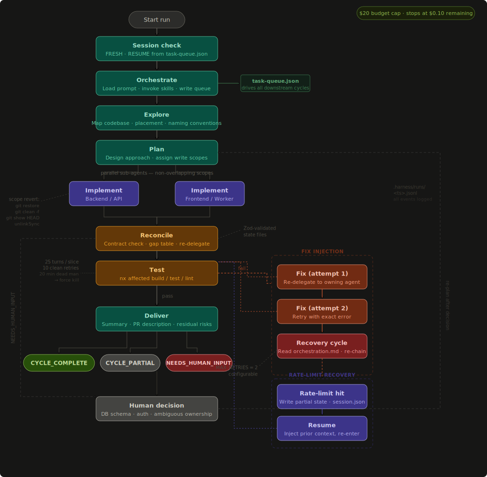

# Cortex — Autonomous Nx Agent Harness

> A config-driven, multi-cycle autonomous agent harness for Nx monorepos. Orchestrates Claude Code sub-agents through a deterministic state machine — explore, plan, implement, reconcile, test, and deliver — with Zod-validated state, git-enforced scope boundaries, and self-healing fix injection.



---

## Why Cortex?

Most agent harnesses give you a single orchestrator loop with no structure between steps. Cortex is different:

| Feature                       | Cortex                                                   | Most harnesses          |
| ----------------------------- | -------------------------------------------------------- | ----------------------- |
| Typed cycle state machine     | ✓ Zod-validated JSON per cycle                           | ✗ free-form chat        |
| Git-enforced write scopes     | ✓ auto-revert out-of-scope changes                       | ✗ agents write anywhere |
| Parallel sub-agents           | ✓ `Promise.allSettled` on non-overlapping scopes         | ✗ sequential only       |
| Fix injection on test failure | ✓ dynamic cycle injection, configurable `MAX_RETRIES`    | ✗ manual retry          |
| Rate-limit recovery           | ✓ writes partial state, `resume` re-enters at last cycle | ✗ start over            |
| Nx-aware verification         | ✓ `nx affected` — only reruns stale projects             | ✗ full rebuild          |
| Config-driven agents          | ✓ drop `harness.config.json` into any Nx workspace       | ✗ code changes needed   |
| Surface auto-detection        | ✓ scans project tree on `init`, no manual path entry     | ✗ hardcoded config      |
| Auto-scope update             | ✓ locks in new paths after unconstrained agent runs      | ✗ manual config update  |

---

## Cycle Flow

```
Start run
  └─ Session check         (FRESH · RESUME from task-queue.json)
  └─ Orchestrate           (load prompt, invoke skills, write task-queue.json + skills.json)
  └─ Explore               (map codebase, placement, naming conventions)
  └─ Plan                  (design approach, assign agent scopes)
  └─ Implement ×N          (parallel sub-agents, non-overlapping scopes)
       ├─ Backend
       └─ Frontend / Worker      ← git scope revert on exit
  └─ Reconcile             (contract check, gap table, re-delegate)
  └─ Test                  (nx affected build / test / lint)
       └─ [on fail] Fix ×MAX_RETRIES  (re-delegate to owning agent)
            └─ [exhausted] Recovery cycle  (read orchestration.md, re-chain)
  └─ Deliver               (summary, PR description, residual risks)
       └─ repeat for next task in queue
```

Each cycle emits exactly one signal: `CYCLE_COMPLETE` · `CYCLE_PARTIAL:<reason>` · `NEEDS_HUMAN_INPUT`

For a deep dive into the engine — task queue structure, turn cap system, safety mechanisms, scope revert cascade, fix injection, and Windows spawning — see [ARCHITECTURE.md](./ARCHITECTURE.md).

---

## Installation

```bash
npm install -g cortex-harness
```

Or run without installing:

```bash
npx cortex-harness init
```

**Requires Node.js ≥ 20** and [Claude Code](https://claude.ai/code) CLI installed and authenticated.

---

## Getting Started

### 1. Initialize

Scaffolds `.harness/` with prompt templates, agent role files, `CLAUDE.md`, and `harness.config.json`. Automatically detects your project's surfaces:

```bash
npx cortex-harness init
```

During init, Cortex walks your project tree, classifies directories by name pattern, and prompts you to confirm the mapping:

```
Nx workspace detected. Confirm surface paths (Enter = keep detected value).

  Backend / serverless paths  [apps/api/]:
  Frontend paths              [apps/web/]:
  Worker / queue paths        [none detected — enter path or leave blank to skip]:
  Shared schema lib paths     [libs/shared/models/]:
  Shared types lib paths      [libs/shared/types/]:
  Shared UI lib paths         [libs/shared/ui/]:

  ✓ harness.config.json updated with your surface paths
  ✓ .harness/agents/*.agent.md scope sections updated
```

Agent `.agent.md` files use `<!-- cortex:surface -->` sentinels — their scope sections are automatically patched to match your confirmed paths, so agents always know exactly where to write.

### 2. Manage scopes

Use the `config` command instead of editing `harness.config.json` directly:

```bash
# View current configuration
cortex-harness config list

# Interactive wizard — pick an agent, update its scope paths
cortex-harness config

# Add a path to an agent's scope
cortex-harness config add-scope backend-subagent libs/shared/models/

# Remove a path from an agent's scope
cortex-harness config remove-scope frontend-subagent libs/shared/ui/
```

Every `config` mutation updates both `harness.config.json` and the scope sections in `.harness/agents/*.agent.md` in one step.

### 3. Run

```bash
cortex-harness run "add a product listing page with search and filters"
```

### 4. Resume a blocked or rate-limited run

```bash
cortex-harness resume "use the existing ProductService, don't create a new one"
```

---

## Scope Enforcement & Auto-Update

Each agent is bound to its declared scope paths. After every implement cycle, Cortex compares changed files against those paths. Out-of-scope writes are automatically reverted via a 4-step git cascade.

**New project with no scopes configured?** Set all agent scopes to `[]` and run. Cortex detects the paths your agents create, locks them into `harness.config.json`, and enforces them from the next cycle onward — shared libs (`libs/shared/`) are automatically distributed to all relevant agents.

---

## Config Reference

| Field        | Type   | Default            | Description                                       |
| ------------ | ------ | ------------------ | ------------------------------------------------- |
| `harnessDir` | string | `.harness`         | Root directory for all harness files              |
| `promptsDir` | string | `.harness/prompts` | Cycle prompt templates                            |
| `agentsDir`  | string | `.harness/agents`  | Agent role definition files                       |
| `agents`     | object | `{}`               | Map of agent name → `{ scope: string[] \| null }` |

`scope: null` — agent may read/verify everywhere (tester).  
`scope: []` — agent is read-only or unconstrained; auto-scope update fires after first run.  
Out-of-scope file writes are automatically reverted by git after each implement cycle.

---

## Cycle Reference

| Cycle         | Type         | What it does                                                            | Output file                |
| ------------- | ------------ | ----------------------------------------------------------------------- | -------------------------- |
| `orchestrate` | planning     | Reads prompt, invokes skills, writes `task-queue.json` + `skills.json`  | `orchestrate.json`         |
| `explore`     | discovery    | Maps file structure, naming conventions, component placement            | `explore.json`             |
| `plan`        | planning     | Designs approach, assigns write scopes to each implement cycle          | `plan.json`                |
| `implement-*` | execution    | Writes source files within declared scope; reverts violations           | `implement-<surface>.json` |
| `reconcile`   | verification | Cross-surface contract check, fills gap table, re-delegates gaps        | `reconcile.json`           |
| `test`        | verification | Runs `nx affected --target=build,test,lint`; 25 turns/slice, 10 retries | `test.json`                |
| `fix-*`       | recovery     | Re-delegates broken surface to owning agent with exact error            | injected dynamically       |
| `recovery`    | recovery     | Reads orchestration.md after MAX_RETRIES exhausted; applies chaining    | injected dynamically       |
| `deliver`     | delivery     | Unified summary, PR description, residual risks                         | `deliver.json`             |

---

## Project Structure

```
.harness/
  prompts/
    orchestrate.md            ← cycle prompt templates (customize freely)
    implement-feature.md
    fix-bug.md
    edit-feature.md
    create-app.md
    test.md
    prompt-orchestration.md
  agents/
    backend-subagent.agent.md      ← scope sections auto-patched by cortex-harness config
    frontend-subagent.agent.md
    distributed-subagent.agent.md
    infra-subagent.agent.md
    tester-subagent.agent.md
    explorer-subagent.agent.md
    planner-subagent.agent.md
  cycle-state/               ← written at runtime (gitignored)
    task-queue.json           ← queue written by orchestrate, consumed by main loop
    skills.json               ← skill output forwarded to implement cycles
    *.json                    ← per-cycle typed output files
  session.json               ← cycle outcome audit trail for interactive resume (gitignored)
  runs/
    <timestamp>.jsonl         ← full event log per run (gitignored)
harness.config.json           ← your workspace config (managed by cortex-harness config)
CLAUDE.md                     ← agent routing and protocol (checked in)
```

---

## License

[MIT](./LICENSE)
